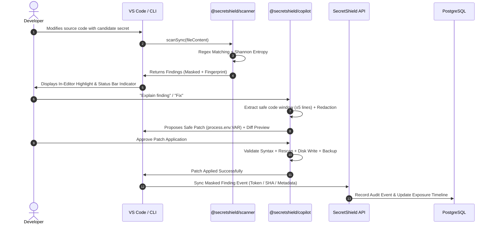

# SecretShield Data Flow

## Data Boundary Invariants

- **Developer Host**: Raw source files are processed strictly in-memory by the local Node.js engine.
- **Network Ingestion**: Only masked strings (`••••••••`), rule IDs, file paths, line numbers, and SHA-256 fingerprints are transmitted over TLS to the central dashboard.
- **Database Storage**: No plaintext secret credentials exist in any table.
